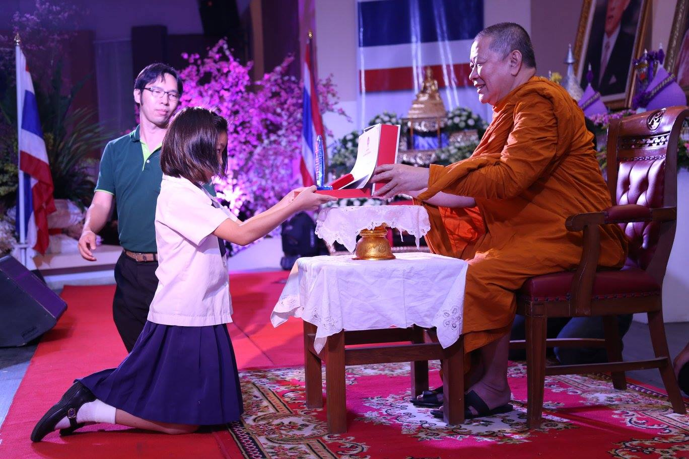
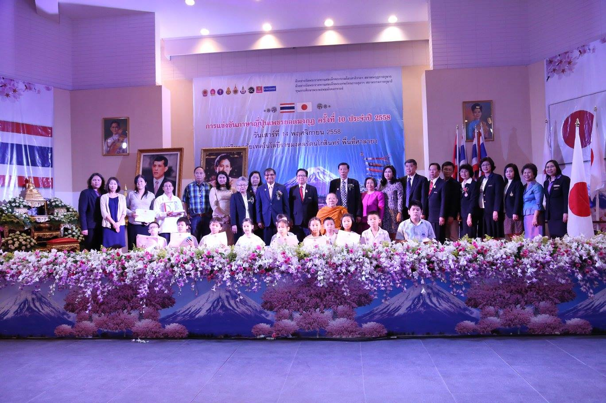

## การแข่งขันภาษาญี่ปุ่นเพชรยอดมงกุฎ  
ประกาศผลการแข่งขันภาษาญี่ปุ่นรอบเพชรยอดมงกุฎ ครั้งที่ 9 การศึกษา 2557  
รยา #4 ชมเชยเพชรยอดมงกุฎ [click](./japanese_petchyodmongkut/ประกาศผลการแข่งขันภาษาญี่ปุ่นเพชรยอดมงกุฏครั้งที่9ระดับประถม.pdf)    

ประกาศผลการแข่งขันภาษาญี่ปุ่นรอบเพชรยอดมงกุฎ ครั้งที่ 10 การศึกษา 2558  
https://www.facebook.com/media/set/?set=a.984985078232070.1073742760.619302088133706  
รยา #1 เหรียญทอง [click](./japanese_petchyodmongkut/cert_jp_pech_raya_gold2015.pdf)    

  

  

  

ประกาศผลการแข่งขันภาษาญี่ปุ่นรอบเพชรยอดมงกุฎ ครั้งที่ 11 การศึกษา 2559  
ระดับประถมศึกษา ปีการศึกษา 2559  
รยา #4 ชมเชยเพชรยอดมงกุฎ [click](./japanese_petchyodmongkut/pratom_r2.pdf)    
http://sreg.rmutr.ac.th/romchat/list/pratom_r2.pdf  

ประกาศผลการแข่งขันภาษาญี่ปุ่นรอบเจียระไนเพชร ครั้งที่ 12 การศึกษา 2560  
อคิระ #13=89 [click](./japanese_petchyodmongkut/reg_rmutr_japan12_01.pdf)  
http://sreg.rmutr.ac.th/romchat/list/reg_rmutr_japan12_01.pdf  
https://grade.rmutr.ac.th/wp-content/uploads/2017/11/reg_rmutr_japan12_01.pdf  
รยา #10=90 [click](./japanese_petchyodmongkut/reg_rmutr_japan12_02.pdf)  
http://sreg.rmutr.ac.th/romchat/list/reg_rmutr_japan12_02.pdf  
https://grade.rmutr.ac.th/wp-content/uploads/2017/11/reg_rmutr_japan12_02.pdf  
ประกาศผลการแข่งขันภาษาญี่ปุ่นรอบเพชรยอดมงกุฎ ครั้งที่ 12 การศึกษา 2560  
ระดับประถมศึกษา ปีการศึกษา 2560  
รยา #2 เหรียญเงิน [click](./japanese_petchyodmongkut/reg_rmutr_japan12_final.pdf)    
https://www.youtube.com/watch?v=Xb9hcGctsqc&t=379s  

ประกาศผลการแข่งขันภาษาญี่ปุ่นรอบเจียระไนเพชร ครั้งที่ 13 การศึกษา 2561  
อคิระ #16=64 [click](./japanese_petchyodmongkut/reg_rmutr_japan_13_1.pdf)    
https://grade.rmutr.ac.th/wp-content/uploads/2018/11/reg_rmutr_japan_13_1.pdf  
รยา ไม่ได้สอบ (KidBright)  

ประกาศผลการแข่งขันภาษาญี่ปุ่นรอบเจียระไนเพชร ครั้งที่ 14 การศึกษา 2562    
อคิระ #7=64 [click](./japanese_petchyodmongkut/reg_rmutr_japan14_001.pdf)    
รยา #7=86 [click](./japanese_petchyodmongkut/reg_rmutr_japan14_002.pdf)  
ประกาศผลการแข่งขันภาษาญี่ปุ่นรอบเพชรยอดมงกุฎ ครั้งที่14 การศึกษา 2562  
ระดับประถมศึกษา ปีการศึกษา2562  
อคิระ = ชมเชยเพชรยอดมงกฎ (9) [click](./japanese_petchyodmongkut/reg_rmutr_japan14_phetyod01.pdf)  
https://grade.rmutr.ac.th/wp-content/uploads/2019/11/reg_rmutr_japan14_phetyod01.pdf  
https://www.youtube.com/watch?v=buEFVfKJEl8&t=558s  
ระดับมัธยมศึกษำตอนต้น ปีกำรศึกษำ2562  
รยา=ชมเชยเพชรยอดมงกฎ (8) [click](./japanese_petchyodmongkut/reg_rmutr_japan14_phetyod02.pdf)  
https://grade.rmutr.ac.th/wp-content/uploads/2019/11/reg_rmutr_japan14_phetyod02.pdf  
https://www.youtube.com/watch?v=buEFVfKJEl8&t=565s  
